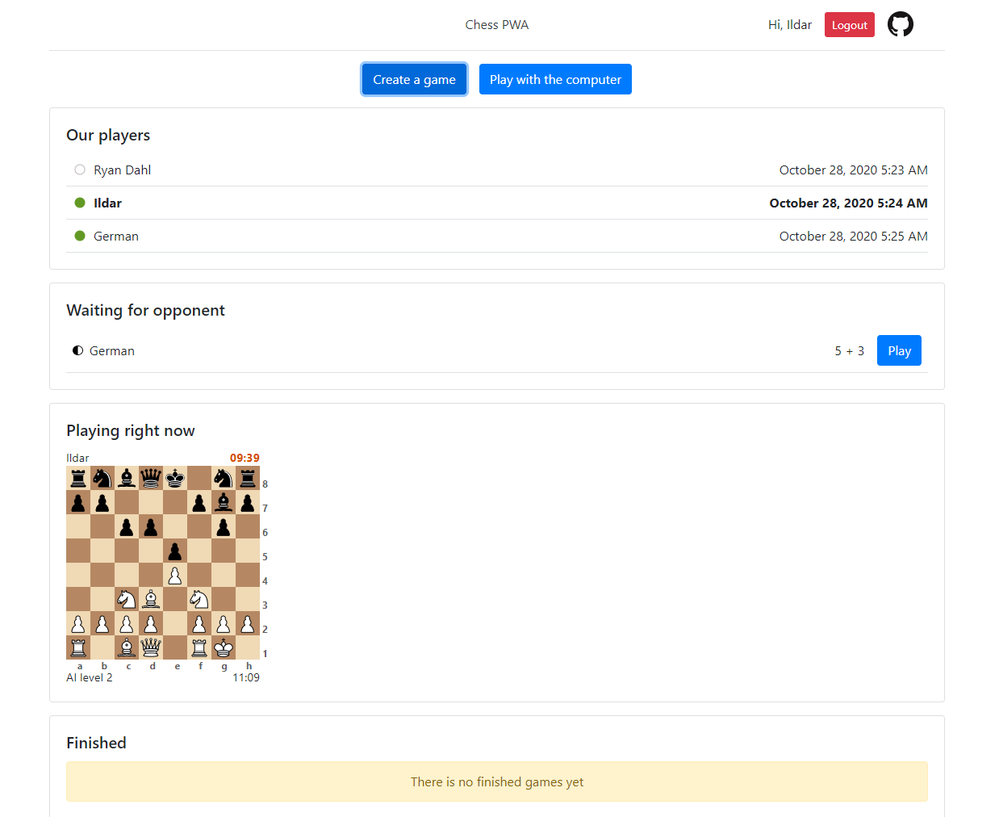
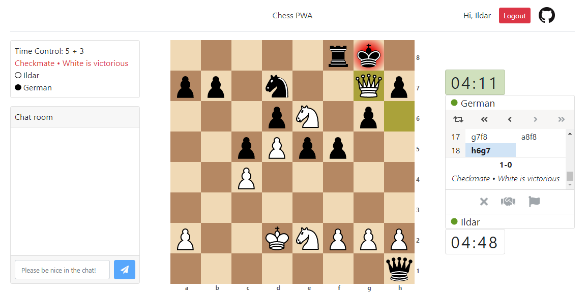

<h1 align="center">Chess PWA</h1>

<p align="center">
    A small <a href="https://reactjs.org/">React</a> application where users can play chess. <a href="https://ildar-icoosoft.github.io/chess-pwa/">Live Demo</a>
</p>

<p align="center">
    
     <a href="https://ildar-icoosoft.github.io/chess-pwa/">
        
    </a>
    <a href="https://codecov.io/gh/ildar-icoosoft/chess-pwa">
        
    </a>
    <a href="https://github.com/semantic-release/semantic-release">
        
    </a>
</p>

<div align="center">
    
</div>
<div align="center">
    
</div>

[Chess backend](https://github.com/ildar-icoosoft/chess-backend) is written in Node.js and relies on [Sails](https://sailsjs.com/) framework.

The application is very small, I made it for demonstration purposes. It contains only 2 pages, but a lot of functionality.

The Home page contains list of users. You can see their online/offline status. On Home page you can accept a game request 
from another person. Or you can create a public seek, to start a game with a random player. Also you can play with the 
computer with 4 levels of strength. Also home page contains previews of ongoing and finished games. All data is updated in real-time via Web Sockets.

The Single game page contains a board to play the game. Control panel with toolbars and moves list.
Game info panel where you can see information about the game. And a Chat to talk with your opponent.

[Chessboard component](https://github.com/ildar-icoosoft/react-chessboard) which is used on Home page to show
game previews and on Single game page to play chess, has flexible settings. It supports Drag and Drop, squares highlighting, animation, premoves, resize and many other functions.

## Installation

```bash
git clone https://github.com/ildar-icoosoft/chess-pwa.git
cd chess-pwa
yarn install
```

Note that this repo contains only frontend. So that the application can work with data, you will need to install the [backend](https://github.com/ildar-icoosoft/chess-backend) as well.

## Start server

```bash
yarn start
```

Runs the app in development mode. Open http://localhost:3000 to view it in the browser.

The page will automatically reload if you make changes to the code. You will see the build errors and lint warnings in the console.

## Run tests

```bash
yarn test
```

Runs the test watcher in an interactive mode. By default, runs tests related to files changed since the last commit.

## Build

```bash
yarn build
```

Builds the app for production to the build folder. It correctly bundles React in production mode and optimizes the build for the best performance.

The build is minified and the filenames include the hashes.

## Live Demo

[Link](https://ildar-icoosoft.github.io/chess-pwa/)